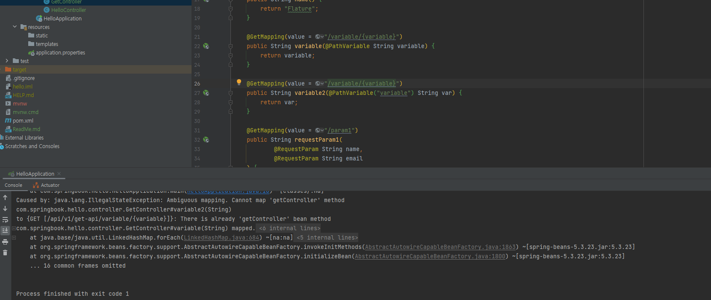

# 스프링 부트를 위한 핵심 가이트 (책)

책 내용을 읽으면서 실습을 따라해보는 실습 레포지토리
공부하거나 배운 내용들, 또는 실습하다 막힌 부분은 따로 작성

### GetController 에러

확인 결과 url 중복으로 인한 에러 발생

### DTO vs VO

DTO : 데이터 전송을 위한 컨테이너로 볼 수 있다. 전달용으로 사용한다  
VO : 데이터 자체로 의미가 있는 객체. 읽기 전용으로 설계한다(데이터의 신뢰성을 유지해야 한다)